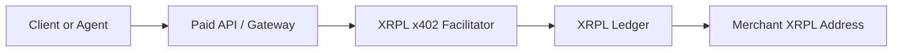

# XRPL x402 Facilitator

[](https://opensource.org/licenses/MIT)
[](https://github.com/lgcarrier/xrpl-x402-facilitator/actions/workflows/ci.yml)
[](https://docs.docker.com/)

**A self-hosted x402 facilitator for the XRP Ledger.**

This project verifies and settles **presigned XRPL Payment transactions** so an
API can accept **XRP** and built-in XRPL-issued assets such as **RLUSD** and
**USDC** without taking custody of user funds.

It is designed for teams that want to price API access in small on-chain
payments while keeping their payment infrastructure simple, auditable, and
stateless.

## Table Of Contents

- [Why This Exists](#why-this-exists)
- [What An XRPL x402 Facilitator Does](#what-an-xrpl-x402-facilitator-does)
- [Where It Fits In A Payment Stack](#where-it-fits-in-a-payment-stack)
- [When To Use This](#when-to-use-this)
- [When Not To Use This](#when-not-to-use-this)
- [Why XRPL Is A Good Fit](#why-xrpl-is-a-good-fit)
- [XRP, RLUSD, And USDC Support](#xrp-rlusd-and-usdc-support)
- [Trust And Custody Model](#trust-and-custody-model)
- [Current Feature Set](#current-feature-set)
- [Current Limitations](#current-limitations)
- [Architecture Notes](#architecture-notes)
- [Configuration](#configuration)
- [Quickstart](#quickstart)
- [API Reference](#api-reference)
- [End-To-End Examples](#end-to-end-examples)
- [Integration Patterns](#integration-patterns)
- [Python Middleware Package](#python-middleware-package)
- [Operational Guidance](#operational-guidance)
- [Testing](#testing)
- [Docker](#docker)
- [Roadmap Ideas](#roadmap-ideas)
- [Contributing](#contributing)
- [Security](#security)
- [License](#license)

## Why This Exists

Most API payment systems force the API operator to become a billing platform.
That usually means some combination of:

- user accounts
- internal balances
- cards or bank rails
- off-ledger credits
- invoicing systems
- payout and custody risk

An **x402 facilitator** is a smaller and narrower component.

Its job is not to be a wallet, exchange, or bank. Its job is to help a paid API
accept a payment that the client has already constructed and signed.

On XRPL, that means the facilitator can:

- inspect a signed XRPL payment blob
- verify that it pays the correct destination
- confirm that the amount is acceptable
- reject obvious replay attempts
- submit the signed transaction to the ledger
- optionally wait for validation before declaring settlement complete

That gives an API operator a clean separation of concerns:

- the **client** creates and signs the transaction
- the **facilitator** verifies and settles it
- the **API or gateway** decides whether to grant access
- the **merchant** receives funds directly on XRPL

## What An XRPL x402 Facilitator Does

In practical terms, this service exposes four endpoints:

- `GET /health`
- `GET /supported`
- `POST /verify`
- `POST /settle`

The service accepts a request containing a presigned XRPL transaction blob. It
decodes the transaction, ensures the destination matches your configured
merchant address, checks minimum amount requirements for XRP payments, and
returns a normalized verification result.

If the payment should actually be sent to the ledger, the facilitator submits
the signed blob and returns the transaction hash. In `validated` mode, it polls
XRPL until the transaction is included in a validated ledger or a timeout is
hit.

This project is intentionally narrow. It does **not**:

- hold user private keys
- sign on behalf of the payer
- manage user balances
- custody funds
- run subscriptions, invoicing, or recurring billing
- provide a database-backed settlement ledger

## Where It Fits In A Payment Stack

An XRPL x402 facilitator is best thought of as **payment middleware for paid
APIs**.



Typical request flow:

1. A client requests a protected resource from your API.
2. Your API or API gateway decides payment is required.
3. The client constructs and signs an XRPL `Payment` transaction to your
   receiving address.
4. The client or gateway sends the signed blob to the facilitator.
5. The facilitator verifies and optionally settles the payment.
6. Your API grants access when the facilitator response meets your policy.

This model is especially useful when the **payment decision must happen close to
the API request itself**, rather than through a separate checkout session.

## When To Use This

This facilitator is a strong fit when you want:

- **per-request or per-call monetization** for APIs
- **micropayments** for AI inference, data access, search, or compute
- **machine-to-machine payments** where a client can sign its own XRPL payment
- **direct merchant receipt** of funds on XRPL
- **minimal payment infrastructure** with no stored-value system
- **self-hosted settlement logic** instead of a third-party payment processor
- **fast integration with a gateway or middleware layer**

Common examples:

- paid LLM or agent endpoints
- premium search or retrieval APIs
- pay-per-use developer tools
- metered webhooks
- robotics or IoT service calls
- content or data APIs with very small unit prices

## When Not To Use This

This project is the wrong tool if you need a broader payment platform.

Do not reach for it first if you need:

- user wallets or private key custody
- internal balances and ledgers
- chargebacks or fiat settlement
- subscription billing
- escrow or multi-party splits
- analytics-heavy billing pipelines
- a fully managed, multi-region payment platform with operations included
- a fully managed payment gateway with compliance and operations included

This v1 keeps the application layer stateless, but it does depend on shared
Redis for replay tracking and rate limiting. That allows markers to survive
restarts and be shared across replicas, but you still own Redis availability,
persistence, and the broader production hardening around it.

## Why XRPL Is A Good Fit

XRPL is attractive for this use case because it is optimized for moving value
efficiently with predictable transaction behavior.

For API operators, the relevant properties are:

- native XRP support
- issued currency support, including assets such as RLUSD and USDC
- deterministic transaction structure
- transaction hashes and ledger validation status
- simple payment semantics for direct merchant receipt

This project uses `xrpl-py` to decode, verify, and submit standard XRPL payment
transactions.

## XRP, RLUSD, And USDC Support

The facilitator supports:

- **XRP**, represented as drops in the transaction amount field
- **issued currencies**, such as **RLUSD** and **USDC**, represented as XRPL
  issued-asset amounts with explicit issuer matching

The service treats XRP and issued currencies differently only where XRPL itself
does. XRP minimum enforcement is controlled through `MIN_XRP_DROPS`, while
issued assets must be strictly positive and are matched against `(currency,
issuer)` pairs.

Built-in issued-asset support is network-aware:

- `xrpl:0` uses issuer `rMxCKbEDwqr76QuheSUMdEGf4B9xJ8m5De`
  for `RLUSD` and issuer `rGm7WCVp9gb4jZHWTEtGUr4dd74z2XuWhE` for `USDC`
- `xrpl:1` uses issuer `rnEVYfAWYP5HpPaWQiPSJMyDeUiEJ6zhy2`
  for `RLUSD` and issuer `rHuGNhqTG32mfmAvWA8hUyWRLV3tCSwKQt` for `USDC`

The facilitator also normalizes issued currencies from either the
human-readable code or the XRPL hex currency code. That includes:

- `RLUSD` or `524C555344000000000000000000000000000000`
- `USDC` or `5553444300000000000000000000000000000000`

If you use RLUSD, USDC, or another issued asset in production, remember that
your walleting and treasury setup still needs the normal XRPL issuer/trust-line
considerations outside this service.

## Trust And Custody Model

The core property of this design is **non-custodial settlement**.

The facilitator never needs the payer's secret. The payer signs the transaction
before it reaches the facilitator.

That means:

- the facilitator cannot arbitrarily redirect user funds by signing new
  transactions
- the merchant receives funds directly at `MY_DESTINATION_ADDRESS`
- there is no application-level balance to withdraw from the facilitator

That said, non-custodial does **not** mean zero trust requirements.

You still need to trust the facilitator to:

- apply your business rules correctly
- verify the right destination and minimum amount
- avoid duplicate processing
- return honest verification results to your API or gateway

In other words, this service removes **fund custody risk**, but not
**application correctness risk**.

## Current Feature Set

- FastAPI service with XRPL-focused verification and settlement endpoints
- XRP and issuer-aware issued asset support
- structured logging via `structlog`
- rate limiting via `slowapi`
- Docker and Docker Compose support
- local smoke tests
- gated live XRPL Testnet integration test
- replay protection based on both `InvoiceID` and blob hash
- partial-payment rejection

## Current Limitations

This repository is intentionally small and production-oriented, but it is still
v1 software.

Current limitations:

- Redis is a required runtime dependency, even for local setups
- there is no database or queue
- there is no admin API
- gateway authentication is shared-secret based, not mTLS or scope-aware
- RegularKey-signed and multisigned XRPL payments are not supported today
- `validated` settlement mode polls the ledger instead of using a more advanced
  event stream

Replay tracking now uses Redis in every supported runtime environment, so
markers survive restarts and can be shared across replicas when the same Redis
deployment is shared.

## Disclaimer

This software is provided as open-source infrastructure, not legal, financial,
or compliance advice.

If you run it in production, you are responsible for:

- your jurisdiction's legal and regulatory requirements
- tax and accounting treatment of payments you accept
- treasury, wallet, and issuer-asset operational controls
- production hardening, monitoring, and abuse prevention

## Architecture Notes

The app is organized around a small service layer:

- `app/main.py` exposes the ASGI app entrypoint
- `app/factory.py` builds the FastAPI app and routes
- `app/xrpl_service.py` handles XRPL transaction decode, verify, submit, and
  validation polling
- `app/config.py` loads runtime settings from environment
- `app/models.py` defines request and response models

The service is stateless apart from the configured replay guard.

## Configuration

Example environment:

```env
GATEWAY_AUTH_MODE=single_token
XRPL_RPC_URL=https://s1.ripple.com:51234
MY_DESTINATION_ADDRESS=rYourXRPLReceivingAddressHere1234567890...
FACILITATOR_BEARER_TOKEN=replace-with-a-random-shared-secret
REDIS_URL=redis://127.0.0.1:6379/0
NETWORK_ID=xrpl:0
SETTLEMENT_MODE=validated
VALIDATION_TIMEOUT=15
MIN_XRP_DROPS=1000
ALLOWED_ISSUED_ASSETS=USD:rIssuerAddress,EUR:rAnotherIssuer
ENABLE_API_DOCS=false
MAX_REQUEST_BODY_BYTES=32768
REPLAY_PROCESSED_TTL_SECONDS=604800
MAX_PAYMENT_LEDGER_WINDOW=20
```

What each variable means:

- `GATEWAY_AUTH_MODE`: `single_token` or `redis_gateways`
- `XRPL_RPC_URL`: XRPL JSON-RPC endpoint the facilitator submits to and queries
- `MY_DESTINATION_ADDRESS`: the merchant address every payment must target
- `FACILITATOR_BEARER_TOKEN`: bearer token shared with the trusted gateway in
  `single_token` mode
- `REDIS_URL`: required Redis connection string for replay tracking, Redis-
  backed gateway auth, and shared app-level rate limiting
- `NETWORK_ID`: informational network label returned by the API
- `SETTLEMENT_MODE`: `validated` or `optimistic`
- `VALIDATION_TIMEOUT`: max number of seconds to wait for validated settlement
- `MIN_XRP_DROPS`: minimum acceptable XRP amount in drops
- `ALLOWED_ISSUED_ASSETS`: optional extra issued assets in `CODE:ISSUER` format
  beyond the built-in XRP, RLUSD, and USDC support
- `ENABLE_API_DOCS`: set to `true` only when you want `/docs`, `/redoc`, and
  `/openapi.json` exposed for local development or a trusted internal network
- `MAX_REQUEST_BODY_BYTES`: maximum size accepted for `POST /verify` and
  `POST /settle` request bodies before the facilitator returns `413`
- `REPLAY_PROCESSED_TTL_SECONDS`: how long processed replay markers stay in the
  configured replay store after a payment is processed
- `MAX_PAYMENT_LEDGER_WINDOW`: maximum number of ledgers a public-mode payment
  may be ahead of the current validated ledger

`validated` is the safer default because your upstream API only receives success
after XRPL validation is confirmed.

`optimistic` is lower-latency but shifts more settlement risk to the caller.

RLUSD and USDC are built in automatically for `xrpl:0` and `xrpl:1`, and any
additional issued assets remain opt-in through `ALLOWED_ISSUED_ASSETS`.

Replay protection now always uses Redis. That means the same replay behavior is
used for local runs, single-token deployments, and `redis_gateways`
deployments, and processed markers survive restarts as long as you keep the
same Redis data.

`POST /verify` and `POST /settle` always require
`Authorization: Bearer <token>`.

- In `single_token` mode, every trusted caller shares
  `FACILITATOR_BEARER_TOKEN`.
- In `redis_gateways` mode, each gateway gets its own opaque bearer token and
  the facilitator looks up the token's SHA-256 hash in Redis under
  `facilitator:gateway_token:<sha256(token)>`.

In `redis_gateways` mode, the facilitator also requires every accepted payment
to include XRPL `LastLedgerSequence`, and it only accepts payments whose window
is still open:

- reject when `LastLedgerSequence <= current validated ledger`
- reject when `LastLedgerSequence > current validated ledger + MAX_PAYMENT_LEDGER_WINDOW`
- accept only when the value falls inside that short validated-ledger window

Payment route rate limits are keyed by authenticated `gateway_id` when one is
available and fall back to peer IP for unauthenticated failures. When
`REDIS_URL` is configured, those limits are stored in Redis so they stay shared
across workers and replicas.

`REPLAY_PROCESSED_TTL_SECONDS` controls replay marker retention, not the payment
freshness window.

The request models also cap `signed_tx_blob` at 16,384 characters and an
optional `invoice_id` match-check field at 128 characters.

### Gateway Authentication

Generate a bearer token for a gateway with a CSPRNG:

```bash
python -c "import secrets; print(secrets.token_urlsafe(32))"
```

In `single_token` mode, store that value as `FACILITATOR_BEARER_TOKEN` on both
the gateway and the facilitator.

In `redis_gateways` mode, store the plaintext token only on the gateway, hash
it with SHA-256, and register the hash in Redis:

```bash
python -c "import hashlib; print(hashlib.sha256(b'your-gateway-token').hexdigest())"
redis-cli HSET facilitator:gateway_token:<sha256(token)> gateway_id gateway-a status active created_at 2026-03-12T00:00:00Z
```

The facilitator never needs the plaintext token in Redis; it hashes the
presented bearer token and looks up the gateway record by hash.

## Quickstart

### Docker Compose

```bash
cp .env.example .env
# edit MY_DESTINATION_ADDRESS and FACILITATOR_BEARER_TOKEN
docker compose up --build
```

The Compose example starts both the facilitator and a local Redis service, then
publishes the facilitator on `http://localhost:8000` only.
If you need remote access, put it behind your gateway or internal network
instead of exposing it directly to the public internet.
Image builds intentionally exclude local files such as `.env`, `.git`, and
`.live-test-wallets/`; keep passing runtime configuration through `.env`,
`env_file`, or `--env-file` instead of expecting those files to be baked into
the image.

### Local Development

```bash
docker run --rm --name xrpl-facilitator-redis -p 6379:6379 redis:7-alpine
python3.12 -m venv .venv
source .venv/bin/activate
pip install -r requirements.txt
pip install -e .
uvicorn app.main:app --reload
```

Non-Compose local runs now require Redis first. The example `.env.example`
already points to `redis://127.0.0.1:6379/0`, so a local Redis on that port is
enough for replay tracking and app-layer rate limiting. Local development also
needs `FACILITATOR_BEARER_TOKEN` in `.env` because the payment endpoints fail
closed without bearer auth.

## API Reference

### `GET /health`

Basic public liveness probe.

Example response:

```json
{
  "status": "healthy",
  "network": "xrpl:0"
}
```

### `GET /supported`

Public capability-discovery endpoint that returns network and supported
settlement assets.

Example response:

```json
{
  "network": "xrpl:0",
  "assets": [
    {"code": "XRP", "issuer": null},
    {"code": "RLUSD", "issuer": "rMxCKbEDwqr76QuheSUMdEGf4B9xJ8m5De"},
    {"code": "USDC", "issuer": "rGm7WCVp9gb4jZHWTEtGUr4dd74z2XuWhE"}
  ],
  "settlement_mode": "validated"
}
```

### `POST /verify`

Checks whether a presigned XRPL payment is acceptable for this facilitator.
Requires `Authorization: Bearer <token>`.
Unsigned transaction blobs are rejected.
The facilitator currently accepts only single-signed XRPL payments whose
`SigningPubKey` derives directly to the transaction `Account`.
RegularKey-signed and multisigned payments are rejected.
If you include `invoice_id` in the request body, the signed XRPL payment must
already embed the same `InvoiceID`.

Example request:

```json
{
  "signed_tx_blob": "120000...",
  "invoice_id": "optional-match-check-for-signed-InvoiceID"
}
```

Example success response:

```json
{
  "valid": true,
  "invoice_id": "ABC123...",
  "amount": "2 XRP",
  "asset": {"code": "XRP", "issuer": null},
  "amount_details": {
    "value": "2000000",
    "unit": "drops",
    "asset": {"code": "XRP", "issuer": null},
    "drops": 2000000
  },
  "payer": "rPayerAddress...",
  "destination": "rYourAddress...",
  "message": "Payment valid"
}
```

In `redis_gateways` mode, the signed XRPL payment must already carry
`LastLedgerSequence`, and that value must still be within the facilitator's
accepted validated-ledger window when `/verify` runs.

The facilitator rejects verification when:

- bearer authentication is missing or invalid
- the blob cannot be decoded as an XRPL payment
- the destination does not match your configured merchant address
- the XRP amount is below your configured minimum
- the issued-asset amount is zero or negative
- the issued asset currency or issuer is not supported
- the transaction sets XRPL partial-payment flags
- a request-body `invoice_id` is sent without a matching signed transaction `InvoiceID`
- in `redis_gateways` mode, `LastLedgerSequence` is missing, expired, or too
  far in the future
- the payment appears to be a replay
- the request body or validated fields exceed the configured size limits

### `POST /settle`

Submits the signed XRPL transaction and optionally waits for validation.
Requires `Authorization: Bearer <token>`.
As with `/verify`, a request-body `invoice_id` is only accepted when the signed
transaction already embeds the same `InvoiceID`.
As with `/verify`, only single-signed payments whose `SigningPubKey` matches the
transaction `Account` are accepted today.

Example request:

```json
{
  "signed_tx_blob": "120000..."
}
```

If another settlement attempt for the same signed blob or invoice is already
pending, the facilitator rejects the request as a replay instead of allowing a
second in-flight settlement.

In `redis_gateways` mode, settlement also rejects payments whose
`LastLedgerSequence` is missing, already expired, or outside the configured
validated-ledger freshness window.

Example validated response:

```json
{
  "settled": true,
  "tx_hash": "672519369674A43EE19CCFC543B170F75DEF96EC25086805E40812333E32AA65",
  "status": "validated"
}
```

The same `LastLedgerSequence` freshness policy applies to `/settle` in
`redis_gateways` mode.

In `validated` mode, success means the transaction reached a validated ledger
and XRPL `delivered_amount` matched the intended asset and value exactly.

## End-To-End Examples

### Example 1: Merchant Capability Discovery

Useful when a gateway or client wants to confirm network and asset support
before attempting payment.

```bash
curl http://localhost:8000/supported
```

Example response:

```json
{
  "network": "xrpl:0",
  "assets": [
    {"code": "XRP", "issuer": null},
    {"code": "RLUSD", "issuer": "rMxCKbEDwqr76QuheSUMdEGf4B9xJ8m5De"},
    {"code": "USDC", "issuer": "rGm7WCVp9gb4jZHWTEtGUr4dd74z2XuWhE"}
  ],
  "settlement_mode": "validated"
}
```

### Example 2: Verify A Signed Payment Before Granting Access

This is the pre-settlement check a gateway would make before deciding whether a
payment blob is structurally acceptable for this merchant.
If you send `invoice_id` in the request body, use it only to confirm the signed
transaction already carries the same XRPL `InvoiceID`.

```bash
curl -X POST http://localhost:8000/verify \
  -H "Authorization: Bearer $GATEWAY_BEARER_TOKEN" \
  -H 'content-type: application/json' \
  -d '{
    "signed_tx_blob": "120000..."
  }'
```

Example response:

```json
{
  "valid": true,
  "invoice_id": "4EF84056B345DB96F7C1AB7568C364006BC37FE6F874231C1F96E63C1083C47D",
  "amount": "2 XRP",
  "asset": {"code": "XRP", "issuer": null},
  "amount_details": {
    "value": "2000000",
    "unit": "drops",
    "asset": {"code": "XRP", "issuer": null},
    "drops": 2000000
  },
  "payer": "rPayerAddress...",
  "destination": "rYourAddress...",
  "message": "Payment valid"
}
```

Typical gateway decision:

1. call `/verify`
2. check `valid == true`
3. confirm the asset and amount fit your pricing policy
4. move on to `/settle` before releasing the paid resource

### Example 3: Settle The Signed Payment

This is the call that actually submits the presigned XRPL transaction.

```bash
curl -X POST http://localhost:8000/settle \
  -H "Authorization: Bearer $GATEWAY_BEARER_TOKEN" \
  -H 'content-type: application/json' \
  -d '{
    "signed_tx_blob": "120000..."
  }'
```

Example response:

```json
{
  "settled": true,
  "tx_hash": "672519369674A43EE19CCFC543B170F75DEF96EC25086805E40812333E32AA65",
  "status": "validated"
}
```

### Example 4: Replay Rejection After Settlement

The same signed blob should not be reusable after a successful settlement while
its replay marker remains in Redis.

```bash
curl -X POST http://localhost:8000/verify \
  -H "Authorization: Bearer $GATEWAY_BEARER_TOKEN" \
  -H 'content-type: application/json' \
  -d '{
    "signed_tx_blob": "120000..."
  }'
```

Example response:

```json
{
  "detail": "Invalid payment: Transaction already processed (replay attack)"
}
```

### Example 5: Full Gateway Decision Flow

This is the typical paid API pattern:

1. client requests a protected API route
2. gateway requires XRPL payment
3. client signs an XRPL `Payment`
4. gateway calls `/verify`
5. gateway calls `/settle`
6. gateway grants the original API request if settlement policy passes

In `validated` mode, the gateway gets a clean answer only after XRPL validation.
In `optimistic` mode, the gateway can reduce latency but accepts more settlement
risk.

## Integration Patterns

You can use this facilitator behind:

- an API gateway
- a custom FastAPI, Express, or Go API
- a serverless function that delegates payment validation
- an AI proxy that charges per prompt, token bucket, or inference call

Typical policy choices:

- call `/verify` before granting a preflight approval
- call `/settle` before releasing the resource
- require `validated` settlement for high-value requests
- allow `optimistic` settlement only for low-risk low-value calls
- reject partial payments at the gateway as a second line of defense

## Python Middleware Package

This repository now also ships a Python package for seller-side x402 route
protection on XRPL.

Published package name:

```bash
pip install xrpl-x402-middleware
```

Local editable install from this repository:

```bash
pip install -e .
```

Supported CAIP-2 network identifiers:

- `xrpl:0` for XRPL mainnet
- `xrpl:1` for XRPL testnet

Minimal FastAPI example:

```python
from fastapi import FastAPI

from xrpl_x402_middleware import PaymentMiddlewareASGI, require_payment

app = FastAPI()
app.add_middleware(
    PaymentMiddlewareASGI,
    route_configs={
        "POST /premium": require_payment(
            facilitator_url="http://127.0.0.1:8000",
            bearer_token="replace-with-your-facilitator-token",
            pay_to="rYourXRPLReceivingAddressHere1234567890...",
            network="xrpl:1",
            xrp_drops=1000,
            description="One premium API call",
        )
    },
)
```

Unpaid requests receive a `402` plus a Base64-encoded `PAYMENT-REQUIRED`
header. Paid retries send a Base64-encoded `PAYMENT-SIGNATURE` header whose
decoded JSON payload looks like:

```json
{
  "x402Version": 2,
  "scheme": "exact",
  "network": "xrpl:1",
  "payload": {
    "signedTxBlob": "120000...",
    "invoiceId": "optional-signed-invoice-id"
  }
}
```

After a successful verify-and-settle flow, the middleware stores the settled
payment context on `request.state.x402_payment` and adds a Base64-encoded
`PAYMENT-RESPONSE` header to the downstream response.

The Python import package is `xrpl_x402_middleware`.

## Operational Guidance

For early deployments:

- run one instance
- run Redis alongside the facilitator
- use `validated` settlement mode
- point at a reliable XRPL RPC
- keep `GATEWAY_AUTH_MODE=single_token` unless you need many gateways
- put the facilitator behind your gateway or internal network when possible
- keep API docs disabled unless they are intentionally exposed to trusted users
- collect logs centrally

For more serious production use:

- use `GATEWAY_AUTH_MODE=redis_gateways` when you need many gateways
- back `REDIS_URL` with a shared Redis deployment for replay coordination and
  per-gateway token lookup; the facilitator also uses that same Redis endpoint
  for shared app-level rate limits
- require gateways to send short-lived XRPL payments with `LastLedgerSequence`
  inside your accepted ledger window
- add metrics and alerts
- decide a clear policy for optimistic vs validated settlement
- load test your XRPL RPC dependency
- enforce request-body and timeout limits at your ingress or reverse proxy in
  addition to the app-level `MAX_REQUEST_BODY_BYTES` safeguard

## Testing

Install test dependencies:

```bash
pip install -r requirements-dev.txt
pip install -e .
PYTHONPYCACHEPREFIX=/tmp/pycache python -m compileall app src tests
```

Run the default test suite:

```bash
pytest
```

If your change affects XRPL settlement, replay protection, ledger submission or
validation, or the live-test tooling, run the full payment-path verification
locally by running both:

```bash
pytest
RUN_XRPL_TESTNET_LIVE=1 pytest -m live tests/integration/test_live_testnet.py -s
```

Run the live XRPL Testnet integration flow:

```bash
RUN_XRPL_TESTNET_LIVE=1 pytest -m live tests/integration/test_live_testnet.py -s
```

The first live run creates a reusable local wallet cache at
`.live-test-wallets/xrpl-testnet-wallets.json`. That file stores Testnet wallet
seeds, is gitignored by default, and lets later reruns reuse the same funded
wallets instead of minting a fresh pair every time. Docker image builds
intentionally exclude that cache along with local `.env` files and Git metadata.

Run only the live XRP flow:

```bash
RUN_XRPL_TESTNET_LIVE=1 pytest -m live tests/integration/test_live_testnet.py -k xrp -s
```

Run the live RLUSD flow:

```bash
RUN_XRPL_TESTNET_LIVE=1 \
pytest -m live tests/integration/test_live_testnet.py -k rlusd -s
```

Run the live USDC flow:

```bash
RUN_XRPL_TESTNET_LIVE=1 \
pytest -m live tests/integration/test_live_testnet.py -k usdc -s
```

Top up the cached RLUSD wallet outside the live test with the optional devtool:

```bash
TRYRLUSD_SESSION_TOKEN=... \
python -m devtools.rlusd_topup
```

Optional override if the faucet rotates the current XRPL Testnet RLUSD issuer:

```bash
XRPL_TESTNET_RLUSD_ISSUER=rCurrentIssuerAddress
```

Prepare the cached USDC wallet for a manual Circle faucet claim:

```bash
python -m devtools.usdc_topup
```

Optional override if the Circle XRPL Testnet issuer changes:

```bash
XRPL_TESTNET_USDC_ISSUER=rCurrentIssuerAddress
```

Optional override for the local wallet cache path:

```bash
XRPL_TESTNET_WALLET_CACHE_PATH=/tmp/xrpl-testnet-wallets.json
```

The local RLUSD top-up helper is only for local live-test workflows; the
facilitator runtime does not depend on it. It writes claim metadata next to the
wallet cache at `.live-test-wallets/rlusd-claim-state.json` by default, tracks
the last successful local claim time for the cached primary wallet, records
every disposable claim wallet and its recovery status, skips remote claims for
24 hours after a successful top-up, and still relies on `tryrlusd.com` as the
source of truth for actual faucet eligibility.

The local USDC top-up helper is also only for local live-test workflows. It
writes claim metadata next to the wallet cache at
`.live-test-wallets/usdc-claim-state.json` by default, prepares one disposable
XRP-funded claim wallet at a time, enforces a conservative 2-hour local
cooldown after a successful USDC recovery, and prints manual instructions for
claiming 20 XRPL Testnet USDC from [Circle Faucet](https://faucet.circle.com/)
because that flow is browser/reCAPTCHA protected.

The live tests:

- uses the XRPL Testnet faucet
- creates and then reuses a funded local wallet pair
- signs and settles a real XRP payment
- can sign and settle a real RLUSD payment without re-claiming when the cached
  wallets already hold enough RLUSD
- can sign and settle a real USDC payment without re-preparing a faucet wallet
  when the cached wallets already hold enough USDC
- can accumulate RLUSD locally across days by reusing the cached wallet pair
  and the local top-up helper
- can accumulate USDC locally across runs by reusing the cached wallet pair and
  tracked manual-claim wallets
- verifies the live payment through the facilitator
- confirms the destination balance increase
- checks replay rejection after settlement

The RLUSD flow also:

- reuses RLUSD already held by the cached wallets and flips sender/receiver as
  balances move
- recovers tracked disposable claim wallets before the live facilitator flow so
  previously unswept RLUSD and XRP can return to the accumulator
- sweeps RLUSD back into the cached primary wallet after a successful live RLUSD
  round trip
- creates live trustlines on XRPL Testnet only when needed
- uses the local helper to create disposable XRP-funded claim wallets, claim 10
  RLUSD into them, sweep that RLUSD into the accumulator, and eventually recover
  the remaining XRP by `AccountDelete`
- makes at most one fresh RLUSD claim attempt per helper run, after recovery and
  only when the cached primary wallet's last recorded successful claim is at
  least 24 hours old
- uses `ALLOWED_ISSUED_ASSETS` so the test can follow the current faucet issuer
- skips with helper guidance when the cached primary/secondary wallets still do
  not hold enough RLUSD after tracked-wallet recovery
- may leave a disposable claim wallet in the local ledger until XRPL allows
  `AccountDelete`; later helper runs retry deletion and recover the wallet's XRP

The USDC flow also:

- reuses USDC already held by the cached wallets and flips sender/receiver as
  balances move
- recovers tracked disposable claim wallets before the live facilitator flow so
  previously unswept USDC and XRP can return to the accumulator
- sweeps USDC back into the cached primary wallet after a successful live USDC
  round trip
- creates live trustlines on XRPL Testnet only when needed
- uses the local helper to create one disposable XRP-funded claim wallet with a
  USDC trustline, then asks you to claim 20 USDC manually from Circle Faucet
- enforces a conservative 2-hour local cooldown after a successful USDC
  recovery, even though Circle documents its faucet limit per address
- relies on built-in USDC support by default, but can temporarily add
  `ALLOWED_ISSUED_ASSETS=USDC:<issuer>` when `XRPL_TESTNET_USDC_ISSUER`
  overrides the built-in testnet issuer
- skips with helper guidance when the cached primary/secondary wallets still do
  not hold enough USDC after tracked-wallet recovery

Delete the wallet cache file if you want a fresh Testnet pair.

Keep that test out of normal CI unless you explicitly want external-network and
faucet-dependent coverage, but treat it as part of pre-merge verification for
changes that touch settlement, replay protection, ledger submission or
validation, or the live-test tooling itself.

The default GitHub Actions workflow intentionally runs only the local suite.
For routine changes, the live XRPL Testnet flow stays opt-in because it depends
on external network availability and faucet behavior.

## Docker

Build manually:

```bash
docker build -t xrpl-x402-facilitator .
```

The image runs the FastAPI service as a non-root user by default. The standard
`docker build` and `docker compose up --build` flow does not require any extra
operator steps, and the build only includes runtime files from `app/` plus
`requirements.txt`. Local secrets, Git metadata, and live-test wallet caches
are intentionally excluded from the Docker build context and final image.

Run manually:

```bash
docker run --rm -p 127.0.0.1:8000:8000 --env-file .env xrpl-x402-facilitator
```

## Roadmap Ideas

Natural next steps for this project:

- Redis operational guidance and HA deployment examples
- gateway token lifecycle tooling
- richer asset policy enforcement
- metrics endpoint
- OpenAPI examples for client implementers
- gateway integration examples
- Helm or Terraform deployment examples

## Contributing

See [CONTRIBUTING.md](CONTRIBUTING.md) for development setup, testing
expectations, and pull request guidance.

## Security

See [SECURITY.md](SECURITY.md) for vulnerability reporting guidance.

## License

MIT. See [LICENSE](LICENSE).
